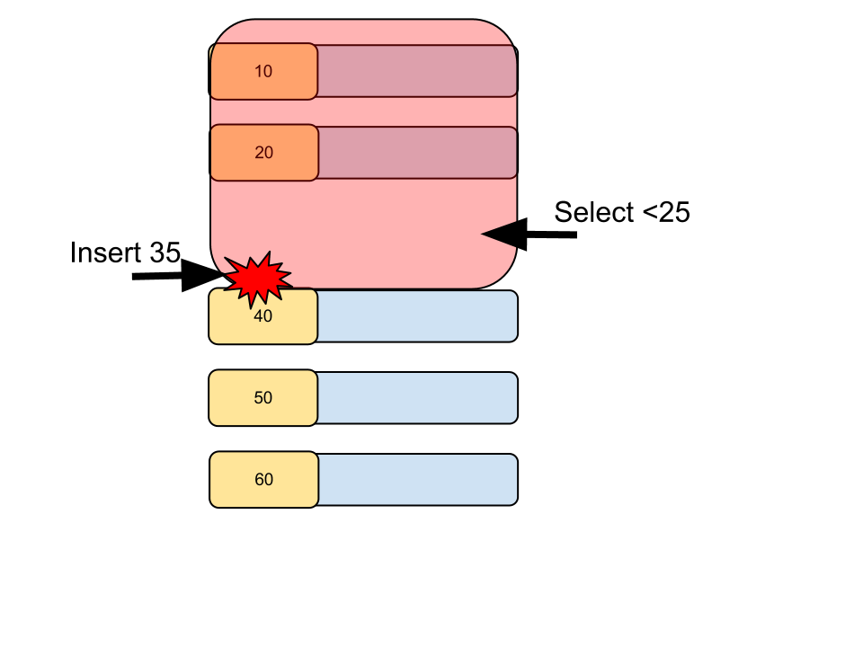
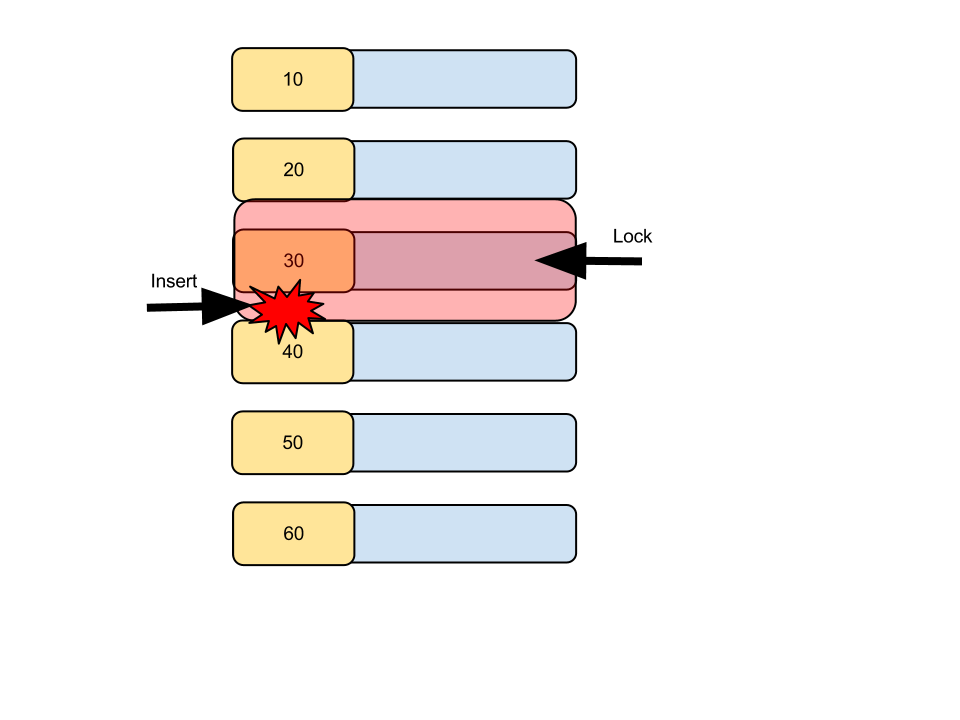

#############
 Transaction
#############

This chapter describes Atomicity and Isolation in MySQL.

What's transaction 
=====================

Transaction is an unit of work.

Since many users (even one user) access to system concurrently,
Database should support **atomicity** and **isolation** for transaction.

Atomicity means "do all, or do nothing".
Isolation means result of query in transaction isn't affected by another transaction.

Consider situation on transferring money from account A to account B.

The schema:

.. code:: sql

    create table account (
        id INTEGER PRIMARY KEY AUTO_INCREMENT,
        amount INTEGER NOT NULL DEFAULT 0
    )

php with Propel:

.. code-block:: php
    :linenos:

    <?php
    class AccountService {
        static function transfer(int $from_id, int $to_id, int $amount) {
            $con = PropelPDO::getConnection('master');
            $con->beginTransaction();
            try {
                $from_account = AccountPeer::retrieveByPK($from_id);
                if ($from_account === null) {
                    throw new Exception("Invalid account $from_id");
                }
                $to_account = AccountPeer::retrieveByPK($to_id);
                if ($to_account === null) {
                    throw new Exception("Invalid account $to_id");
                }
                if ($from_account->getAmount() < $amount) {
                    throw new Exception("account $from_id doesn't have enough money. (" .
                                        $from_account->getAmount() . " < $amount)");
                }
                $from_account->setAmount($from_account->getAmount() - $amount);
                $from_account->save($con);
                $to_account->setAmount($to_account->getAmount() + $amount);
                $to_account->save($con);
                $con->commit();
            } catch (Exception $e) {
                $con->rollback();
                throw $e;
            }
        }
    }

Python with SQLAlchemy:

.. code-block:: python
    :linenos:

    # accountservice.py
    def transfer(from_id, to_id, amount):
        with Session.begin():  # Session manages connection and Unit of Work.
            # commit on exit without exception.
            # Or rollback on exit with exception
            from_account = Session.query(Account).get(from_id)
            if not from_account:
                raise Exception("Bad account id: %r" % (from_id,))

            if from_account.amount < amount:
                raise Exception("account %d doesn't have enough money. (%d < %d)" %
                                (from_id, from_account.amount, amount))

            to_account = Session.query(Account).get(to_id)
            if not to_account:
                raise Exception("Bad account id: %r" % (to_id,))

            from_account.amount -= amount
            to_account.amount += amount

.. note::

    This example has a problem. We discuss it later.

After transaction, money is completely transferred or not transferred.
Total amount should not be changed. This is atomicity.

While this transaction, ``SELECT SUM(amount) FROM account WHERE id IN (:from_id, :to_id)``
from other transaction always shows right value. Other transaction always see state of before or
after transaction but not intermediate state.

.. note::

    MySQL can select transaction isolation level. It's default is "repeatable read".
    This chapter suppose this transaction isolation level.

    Other isolation levels are:

        - read uncommitted
        - read committed
        - serialized

autocommit
===========
MySQL has **autocommit** mode that is default on.

autocommit means one query is one transaction unless explicitly ``BEGIN``.
When autocommit is disabled, first query starts transaction implicitly and
``COMMIT`` is required to save changes.

example
~~~~~~~

In this chapter, following table is used repeatedly as example.

.. code:: sql

    CREATE TABLE `test1` (
        `id` int(11) NOT NULL,
        `other_id` int(11) DEFAULT NULL,
        `data` int(11) DEFAULT NULL,
        PRIMARY KEY (`id`),
        KEY `idx_1` (`other_id`)
    ) ENGINE=InnoDB DEFAULT CHARSET=utf8mb4;

Start 2 mysql session. Update from one session and check from other session.
Two sessions are separated with indent level.

autocommit=1:

::

    mysql> select @@autocommit;  # Check autocommit is enabled.
    +--------------+
    | @@autocommit |
    +--------------+
    |            1 |
    +--------------+
    1 row in set (0.00 sec)

    mysql> insert into test1 (id, other_id, data) values (1, 100, 123);
    Query OK, 1 row affected (0.01 sec)

                                                    # inserted row can be seen from another session.
                                                    mysql> select * from test1;
                                                    +----+----------+------+
                                                    | id | other_id | data |
                                                    +----+----------+------+
                                                    |  1 |      100 |  123 |
                                                    +----+----------+------+
                                                    1 row in set (0.00 sec)

    # explicitly BEGIN transaction
    mysql> begin;
    Query OK, 0 rows affected (0.00 sec)

    mysql> insert into test1 (id, other_id, data) values (2, 90, 100);
    Query OK, 1 row affected (0.00 sec)

                                                    # new row can't be seen from another session.
                                                    # It's not committed yet.
                                                    mysql> select * from test1;
                                                    +----+----------+------+
                                                    | id | other_id | data |
                                                    +----+----------+------+
                                                    |  1 |      100 |  123 |
                                                    +----+----------+------+
                                                    1 row in set (0.00 sec)

    mysql> commit;
    Query OK, 0 rows affected (0.01 sec)

                                                    # committed row can be seen.
                                                    mysql> select * from test1;
                                                    +----+----------+------+
                                                    | id | other_id | data |
                                                    +----+----------+------+
                                                    |  1 |      100 |  123 |
                                                    |  2 |       90 |  100 |
                                                    +----+----------+------+
                                                    2 rows in set (0.00 sec)

autocommit=0:

::

    # Disable autocommit in this session.
    mysql> set @@autocommit=0;
    Query OK, 0 rows affected (0.00 sec)

    mysql> insert into test1 (id,other_id,data) values (3,80,99);
    Query OK, 1 row affected (0.00 sec)

                                                    # id=3 can't be seen yet.
                                                    mysql> select * from test1;
                                                    +----+----------+------+
                                                    | id | other_id | data |
                                                    +----+----------+------+
                                                    |  1 |      100 |  123 |
                                                    |  2 |       90 |  100 |
                                                    +----+----------+------+
                                                    2 rows in set (0.00 sec)

    mysql> commit;
    Query OK, 0 rows affected (0.00 sec)

                                                    mysql> select * from test1;
                                                    +----+----------+------+
                                                    | id | other_id | data |
                                                    +----+----------+------+
                                                    |  1 |      100 |  123 |
                                                    |  2 |       90 |  100 |
                                                    |  3 |       80 |   99 |
                                                    +----+----------+------+
                                                    3 rows in set (0.00 sec)

MVCC
=====

**MVCC** (Multi Version Concurrency Control) achieves both of concurrent update and isolation.

While execute update transaction, MVCC doesn't overwrite but create **new version**.

First query (including SELECT query) in transaction uses newest version.
Continued SELECT queries sees the version same to first query.

example
~~~~~~~~

::

    mysql> begin;
    Query OK, 0 rows affected (0.00 sec)

    mysql> select * from test1;  # This transaction is set to this version.
    +----+----------+------+
    | id | other_id | data |
    +----+----------+------+
    |  1 |      100 |  123 |
    |  2 |       90 |  100 |
    |  3 |       80 |   99 |
    +----+----------+------+
    3 rows in set (0.00 sec)

                                                    # update (and autocommit) from another session creates new version.
                                                    mysql> update test1 set other_id=70 where id=2;
                                                    Query OK, 1 row affected (0.00 sec)

    # But left session continue to see old version.
    mysql> select * from test1;
    +----+----------+------+
    | id | other_id | data |
    +----+----------+------+
    |  1 |      100 |  123 |
    |  2 |       90 |  100 |
    |  3 |       80 |   99 |
    +----+----------+------+
    3 rows in set (0.00 sec)

    # Stop transaction
    mysql> rollback;
    Query OK, 0 rows affected (0.00 sec)

    # Next (autocommitted) transaction sees newest version.
    mysql> select * from test1;
    +----+----------+------+
    | id | other_id | data |
    +----+----------+------+
    |  1 |      100 |  123 |
    |  2 |       70 |  100 |
    |  3 |       80 |   99 |
    +----+----------+------+
    3 rows in set (0.00 sec)

Lock
=====

MVCC isolates between update transaction and read only transaction automatically.

But concurrent two update transaction cause **Lost update** problem.

Lost update example
~~~~~~~~~~~~~~~~~~~~

When multiple transaction "Read - Modify - Write" in same time, one transaction
overwrites another transaction. This problem is called **Lost Update**.

::

    # A player adds 3 points to team.
    > SELECT point FROM team WHERE team_id=3;
    5

                                                    # Another player in same team adds 5 points.
                                                    > SELECT point FROM team WHERE team_id=3;
                                                    5

    > UPDATE team SET point=8 WHERE team_id=3;

                                                    > UPDATE team SET point=10 WHERE team_id=3;

    # 3 points disappeared...

In php + Propel:

.. code-block:: php
    :linenos:

    <?php
    class QuestService {
        static function doQuest(Player $player, int $quest_id) {
            $con = Propel::getConnection('master');
            $con->beginTransaction();
            try {
                // ...
                $team = TeamPeer::retrieveByPK($player->getTeamId(), $con);
                $team->setPoint($team->getPoint() + $got_point);
                $team->save($con);
                // ...
                $con->commit();
            } except (Exception $e) {
                $con->rollback();
                throw $e;
            }
        }
    }

In Python + SQLAlchemy:

.. code-block:: python
    :linenos:

    # quest_service.py
    def do_quest(player, quest_id):
        with Session.begin():
            #...
            team = Session.query(Team).get(player.team_id)
            team.point += got_point
            #...

lock example
~~~~~~~~~~~~~~

Update query automatically acquires lock. ``SELECT ... FOR UPDATE`` also acquire lock.

.. code:: sql

    # A player adds 3 points to team.
    > BEGIN
    > SELECT point FROM team WHERE team_id=3 FOR UPDATE;
    5

                                                    # Another player in same team adds 5 points.
                                                    > BEGIN
                                                    > SELECT point FROM team WHERE team_id=3 FOR UPDATE;
                                                    # ... waiting...

    > UPDATE team SET point=8 WHERE team_id=3;
    > COMMIT

                                                    8
                                                    > UPDATE team SET point=13 WHERE team_id=3;
                                                    > COMMIT

Better example (less waittime):

.. code:: sql

    # A player adds 3 points to team.
    # This locks only while single query (autocommit)
    > UPDATE team SET point=point+3 WHERE team_id=3;

                                                    # Another player in same team adds 5 points.
                                                    # This also waits until left query is committed.
                                                    # But lock time is shorter.
                                                    > UPDATE team SET point=point+5 WHERE team_id=3;

Propel's ``SELECT ... FOR UPDATE`` support has several bugs.
So we've customized code generator to make better ``retrieveByPkForUpdate()`` automatically.
Here is php + Propel example:

.. code-block:: php
   :linenos:

    <?php
    class QuestService {
        static function doQuest(Player $player, int $quest_id) {
            $con = Propel::getConnection('master');
            $con->beginTransaction();
            try {
                // ...
                $team = TeamPeer::retrieveByPKForUpdate($player->getTeamId(), $con);
                $team->setPoint($team->getPoint() + $got_point);
                $team->save($con);
                // ...
                $con->commit();
            } except (Exception $e) {
                $con->rollback();
                throw $e;
            }
        }
    }

SQLAlchemy supports ``FOR UPDATE`` as ``query.with_lockmode('update')``.
You can use this not only for selecting by PK.

.. code-block:: python
   :linenos:

    # quest_service.py
    def do_quest(player, quest_id):
        with Session.begin():
            #...
            team = Session.query(Team).with_lockmode('update').get(player.team_id)
            team.point += got_point
            #...

You can use ``point=point+n`` too on SQLAlchemy. But it's tricky a bit.
I recommend to write SQL directly.

.. code-block:: python
   :linenos:

    # quest_service.py
    def do_quest(player, quest_id):
        with Session.begin():
            #...
            team = Session.query(Team).get(player.team_id)
            # `Team.point + got_point` is query expression.
            # This query is executed on saving changes.
            # Result value will be fetched after save.
            team.point = Team.point + got_point
            #...

row lock and table lock
~~~~~~~~~~~~~~~~~~~~~~~~~

One very important thing about lock is granularity.
If one lock blocks all other sessions, it's called "global lock".

In MySQL, global lock is rare. But sometimes table lock happens.
For example, ``ALTER TABLE`` requires table lock.
``CREATE INDEX`` also acquires table lock in MySQL 5.5.
(MySQL 5.6 supports online create index).

Normal query may acquires table lock too.
Please consider following case::

    > BEGIN;
    > SELECT SUM(point) FROM player WHERE team_id=1234 FOR UPDATE;  -- (1)
    42
    > UPDATE team SET total_point=42 WHERE team_id=1234;
    > COMMIT

After (1) query, other session can't ``INSERT INTO player (..., team_id) VALUES (..., 1234)``,
``UPDATE player SET point=point+5 WHERE id=7`` (player id 7 belongs to team 1234), and
``UPDATE player SET team_id=7743 WHERE id=7``.

But... how can MySQL distinguish queries to blocked?

The first answer is table lock. MySQL can block all queries updating ``player`` table.
This is big problem. (Q: Can you why this is a big problem?)

So, next answer is key. If you create index to ``player.team_id`` column,
queries like ``SELECT ... WHERE team_id=1234 FOR UPDATE`` locks ``team_id=1234`` index record
and all affected PK record.

Inserting new player having ``team_id=1234`` should update index on ``team_id`` but it's locked.
Updating player having ``id=7`` should lock PK but it's locked if the player's team_id is 1234.
Such queries are blocked until transaction acquiring the lock is committed.

All other queries modifying ``player`` table can be executed without block safely.

Example: table lock
~~~~~~~~~~~~~~~~~~~~

::

    mysql> begin;
    Query OK, 0 rows affected (0.00 sec)

    # "data" column doesn't have index. So this is table lock.
    mysql> select * from test1 where data=100 for update;
    +----+----------+------+
    | id | other_id | data |
    +----+----------+------+
    |  2 |       70 |  100 |
    +----+----------+------+
    1 row in set (0.00 sec)

                                    mysql> select * from test1 where id=1 for update;
                                    # blocked...

    mysql> rollback;
    Query OK, 0 rows affected (0.00 sec)

                                    +----+----------+------+
                                    | id | other_id | data |
                                    +----+----------+------+
                                    |  1 |      100 |  123 |
                                    +----+----------+------+
                                    1 row in set (12.13 sec)

Example: row lock
~~~~~~~~~~~~~~~~~~

.. code::

    mysql> begin;
    Query OK, 0 rows affected (0.00 sec)

    mysql> select * from test1 where id=2 for update;
    +----+----------+------+
    | id | other_id | data |
    +----+----------+------+
    |  2 |       70 |  100 |
    +----+----------+------+
    1 row in set (0.00 sec)

                                    # locking id=2 doesn't blocks id=1.
                                    mysql> select * from test1 where id=1 for update;
                                    +----+----------+------+
                                    | id | other_id | data |
                                    +----+----------+------+
                                    |  1 |      100 |  123 |
                                    +----+----------+------+
                                    1 row in set (0.00 sec)

                                    mysql> select * from test1 where id=2 for update;
                                    # blocked...

    mysql> rollback;
    Query OK, 0 rows affected (0.00 sec)

                                    +----+----------+------+
                                    | id | other_id | data |
                                    +----+----------+------+
                                    |  2 |       70 |  100 |
                                    +----+----------+------+
                                    1 row in set (2.86 sec)

More about locks
==================

MVCC and Updating
~~~~~~~~~~~~~~~~~~

As I said before, ``SELECT`` returns may be old version.
This also cause lost update.
So ``SELECT ... FOR UPDATE`` ignores MVCC and returns newest value.

And after updating record, ``SELECT`` returns updated version instead of
transaction beginning version.

Example
~~~~~~~~

.. code::

    mysql> begin;
    Query OK, 0 rows affected (0.00 sec)
    mysql> select * from test1;
    +----+----------+------+
    | id | other_id | data |
    +----+----------+------+
    |  1 |      100 |  123 |
    |  2 |       70 |  100 |
    |  3 |       89 |   99 |
    |  4 |       60 |   10 |
    +----+----------+------+
    4 rows in set (0.00 sec)

                                    mysql> update test1 set other_id=0 where id in (2,3);
                                    Query OK, 2 rows affected (0.01 sec)
                                    Rows matched: 2  Changed: 2  Warnings: 0

    # normal select returns old version because of MVCC.
    mysql> select * from test1;
    +----+----------+------+
    | id | other_id | data |
    +----+----------+------+
    |  1 |      100 |  123 |
    |  2 |       70 |  100 |
    |  3 |       89 |   99 |
    |  4 |       60 |   10 |
    +----+----------+------+
    4 rows in set (0.00 sec)

    # But SELECT...FOR UPDATE returns newest value.
    mysql> select * from test1 where id=2 for update;
    +----+----------+------+
    | id | other_id | data |
    +----+----------+------+
    |  2 |        0 |  100 |
    +----+----------+------+
    1 row in set (0.01 sec)

    # Again, normal select returns old version because of MVCC.
    mysql> select * from test1;
    +----+----------+------+
    | id | other_id | data |
    +----+----------+------+
    |  1 |      100 |  123 |
    |  2 |       70 |  100 |
    |  3 |       89 |   99 |
    |  4 |       60 |   10 |
    +----+----------+------+
    4 rows in set (0.00 sec)

    mysql> update test1 set other_id=1000 where id=2;
    Query OK, 1 row affected (0.00 sec)
    Rows matched: 1  Changed: 1  Warnings: 0

    # after updating, values of id=2 row are updated version.
    mysql> select * from test1;
    +----+----------+------+
    | id | other_id | data |
    +----+----------+------+
    |  1 |      100 |  123 |
    |  2 |     1000 |  100 |
    |  3 |       89 |   99 |
    |  4 |       60 |   10 |
    +----+----------+------+
    4 rows in set (0.00 sec)

Gap lock and Next key lock
~~~~~~~~~~~~~~~~~~~~~~~~~~~~

When locking query doesn't matches to records, the query locks between rows to
block other transaction inserts records matched. This is called Gap lock.

When a query locks non-unique key, it also locks gap before and after the records
to block other transactions inserts records there. This is called next key lock.

Example: Gap lock
~~~~~~~~~~~~~~~~~~~

::

    mysql> show create table test1\G
    *************************** 1. row ***************************
            Table: test1
    Create Table: CREATE TABLE `test1` (
      `id` int(11) NOT NULL,
      `other_id` int(11) DEFAULT NULL,
      `data` int(11) DEFAULT NULL,
      PRIMARY KEY (`id`),
      KEY `idx_1` (`other_id`)
    ) ENGINE=InnoDB DEFAULT CHARSET=utf8mb4
    1 row in set (0.00 sec)

    mysql> select * from test1;
    +----+----------+------+
    | id | other_id | data |
    +----+----------+------+
    |  1 |      100 |  123 |
    |  2 |       70 |  100 |
    |  3 |       80 |   99 |
    +----+----------+------+
    3 rows in set (0.00 sec)

    mysql> begin;
    Query OK, 0 rows affected (0.00 sec)

    mysql> select * from test1 where id=100 for update; # Last gap (id > 3) is locked
    Empty set (0.00 sec)

                                    mysql> insert into test1 (id, other_id, data) values (4, 60, 10);

    mysql> rollback;
    Query OK, 0 rows affected (0.00 sec)

                                    Query OK, 1 row affected (5.83 sec)

Example: Next key lock
~~~~~~~~~~~~~~~~~~~~~~~

::

    mysql> select * from test1;
    +----+----------+------+
    | id | other_id | data |
    +----+----------+------+
    |  1 |      100 |  123 |
    |  2 |       70 |  100 |
    |  3 |       80 |   99 |
    |  4 |       60 |   10 |
    +----+----------+------+
    4 rows in set (0.00 sec)

    mysql> begin;
    Query OK, 0 rows affected (0.00 sec)

    mysql> select * from test1 where other_id=70 for update;
    +----+----------+------+
    | id | other_id | data |
    +----+----------+------+
    |  2 |       70 |  100 |
    +----+----------+------+
    1 row in set (0.00 sec)

                                    mysql> insert into test1 (id, other_id, data) values (5, 65, 0);

    mysql> rollback;
    Query OK, 0 rows affected (0.00 sec)

                                    Query OK, 1 row affected (6.20 sec)

Realistic problem examples
===========================

Too long lock
~~~~~~~~~~~~~~~~~

::

    > BEGIN;
    > UPDATE guild_point SET point=point+5 where guild_id=9;
    (Calling external HTTP API here ...)
    > COMMIT

Dead lock
~~~~~~~~~~~~~

One of famous problem about lock.

One session has lock A and trying to get lock B.
Another session has lock B and trying to get lock A.
Both session can't lock.

To avoid deadlock, decide ordering to lock.
For example, "lock player before team" or "lock row with smaller id first".

.. code-block:: php
    :linenos:

    <?php
    class AccountService {
        static function transfer(int $from_id, int $to_id, int $amount) {
            $con = PropelPDO::getConnection('master');
            $con->begin();
            try {
                // lock lower id first
                if ($from_id < $to_id) {
                    $from_account = AccountPeer::retrieveByPkForUpdate($from_id);
                    $to_account = AccountPeer::retrieveByPkForUpdate($to_id);
                } else {
                    $to_account = AccountPeer::retrieveByPkForUpdate($to_id);
                    $from_account = AccountPeer::retrieveByPkForUpdate($from_id);
                }
                if ($from_account === null) {
                    throw new Exception("Invalid account $from_id");
                }
                if ($to_account === null) {
                    throw new Exception("Invalid account $to_id");
                }
                if ($from_account.getAmount() < $amount) {
                    throw new Exception("account $from_id doesn't have enough money. (" .
                                        $from_account->getAmount() . " < $amount)");
                }
                $from_account->setAmount($from_account->getAmount() - $amount);
                $from_account->save($con);
                $to_account->setAmount($to_account->getAmount() + $amount);
                $to_account->save($con);
                $con->commit();
            } catch (Exception $e) {
                $con->rollback();
                throw $e;
            }
        }
    }

.. code-block:: python
    :linenos:

    # accountservice.py
    # ...
    def transfer(from_id, to_id, amount):
        with Session.begin():
            # lock lower id first.
            if from_id < to_id:
                from_account = Session.query(Account).with_lockmode('update').get(from_id)
                to_account = Session.query(Account).with_lockmode('update').get(to_id)
            else:
                to_account = Session.query(Account).with_lockmode('update').get(to_id)
                from_account = Session.query(Account).with_lockmode('update').get(from_id)

            if not from_account:
                raise Exception("Bad account id: %r" % (from_id,))
            if not to_account:
                raise Exception("Bad account id: %r" % (to_id,))
            if from_account.amount < amount:
                raise Exception("account %d doesn't have enough money. (%d < %d)" %
                                (from_id, from_account.amount, amount))

            from_account.amount -= amount
            to_account.amount += amount

Gap lock herd
~~~~~~~~~~~~~~

.. code:: php

    <?php
    // person is created before.
    // person.id is autoincremented PK.
    // person_status is created when first required.
    $person_status = PersonStatusPeer::retrieveByPkForUpdate($person->getId(), $con);
    if ($person_status === null) {
        // **Last gap is locked.**
        $person_status = new PersonStatus();
        $person_status->setPersonId($person->getId());
    }
    // lots of initializing code...
    $person_status->save($con);
    $con->commit();

When many new users come, many users locks one last gap.
So you should commit as soon as possible.

How to analyze problems
========================

- slow query log (find queries take long time)
- show engine status (find deadlock etc..)
- Use a query described in http://d.hatena.ne.jp/sh2/20090618 (detect which query is blocked.)
- `myprofiler <https://github.com/KLab/myprofiler>`_ (find slow, massive, blocked queries.)
